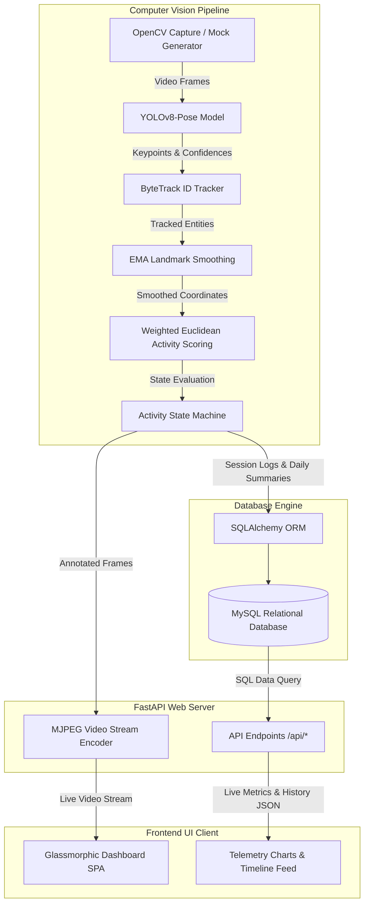
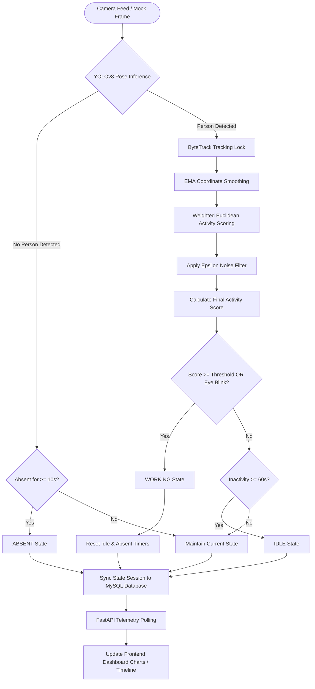

# AuraSense - Camera-Based Employee Activity Monitoring System (PoC)

AuraSense is a modern, proof-of-concept employee activity monitoring system that processes camera feeds using real-time computer vision to detect user engagement levels. The system dynamically classifies subject states as **WORKING**, **IDLE**, or **ABSENT** and aggregates these events inside a relational database to compute a daily productivity index.

---

## 🏗️ System Architecture

AuraSense is designed as a decoupled, multi-tiered application to ensure real-time performance, consistent state synchronization, and low telemetry latency.



### 1. Ingestion & Core Computer Vision Engine (`cv_pipeline.py`)
* **OpenCV Frame Capturer**: Reads real-time feed at 15 FPS from hardware webcam (Index `0`). If a camera is absent or mock mode is toggled, it falls back to a procedural mock generator that renders a simulated 3D skeleton typing, idling, or leaving.
* **YOLOv8 Pose Engine**: Run on every frame to detect human keypoints.
* **ByteTrack Tracker**: Keeps a consistent track ID on the primary employee to prevent user swapping when multiple people enter the frame.
* **EMA Smoothing & Epsilon Filters**: Algorithms to eliminate coordinate jitter and filter out environmental noise.

### 2. State Machine & Event Manager
* The core state machine transitions the active session segment based on real-time activity and time boundaries.
* Transitions trigger database handlers via SQLAlchemy to close active segments, write durations, and spawn new segments.

### 3. FastAPI Web Server & API Layer (`main.py` & `api/routes.py`)
* Exposes transactional endpoints for dashboard statistics.
* Includes an MJPEG streaming endpoint that packages opencv-annotated skeletal frames directly into a live stream.

### 4. Storage Layer (`models.py`, `database.py` & `schema.sql`)
* Relational database using MySQL.
* Maintains tables for `employees`, `activity_logs` (event durations, states, and scores), and `daily_summary` (historical daily rollups).

---

## 🔄 System Workflow

The flowchart below demonstrates the frame-by-frame computational workflow and state transition cycle:



---

## 🛠️ Technology Stack

* **Frontend**: HTML5 (semantic layout), CSS3 (glassmorphic dark-mode interface, CSS Custom Variables), Vanilla ES6 JavaScript, Chart.js (Real-time telemetry and doughnut charts).
* **Backend**: Python 3.9+, FastAPI (high-performance asynchronous framework), Uvicorn (ASGI web server), SQLAlchemy ORM (Object Relational Mapping).
* **Computer Vision**: OpenCV (image manipulation, HUD rendering, video streaming), Ultralytics YOLOv8.
* **Database**: MySQL 8.0/9.x (Relational storage with composite indexes for rapid historical querying).

---

## 🧠 Machine Learning Models & Heuristics

AuraSense relies on a combination of deep learning models and custom mathematical heuristics to monitor subject states:

### 1. YOLOv8 Pose Estimation Model (`yolov8n-pose.pt`)
* **Type**: Deep Convolutional Neural Network with an anchor-free detection head and a pose estimation branch, pre-trained on the MS COCO Keypoints dataset.
* **Model Variant**: Nano (`yolov8n-pose.pt`) - chosen specifically for low latency and efficient real-time execution on standard consumer CPU configurations.
* **Outputs**: Extracts 17 human skeletal joints with their relative `(x, y)` coordinates and detection confidence scores.

### 2. ByteTrack Tracking Model (`bytetrack.yaml`)
* **Type**: Multi-Object Tracking (MOT) algorithm.
* **Function**: Tracks individuals by calculating Kalman filter motion predictions and measuring overlap (Intersection over Union - IoU) of bounding boxes.
* **Role**: Locks tracking onto the primary employee (`DEFAULT_EMPLOYEE_ID`) based on the largest detected bounding box and maintains their identity, preventing model confusion when other individuals enter the background.

### 3. Mathematical Heuristics & Filters

#### A. Exponential Moving Average (EMA) Coordinate Smoothing
To remove coordinate jitter caused by lighting variations or minor camera noise, keypoint coordinates are smoothed frame-by-frame using an EMA filter:

$$S_t = \alpha \cdot K_t + (1 - \alpha) \cdot S_{t-1}$$

* Where $K_t$ is the raw keypoint coordinate in frame $t$.
* $S_t$ is the smoothed keypoint coordinate.
* $\alpha$ is the smoothing factor (default: `0.35`).

#### B. Weighted Euclidean Displacement Scoring
Activity is calculated by measuring the normalized distance that key joints travel between consecutive frames. Movements are grouped and weighted:

$$\text{Activity Score} = \sum (\text{Weight}_{\text{group}} \times \text{Displacement}_{\text{group}}) \times 100$$

* **Hands (Wrists)**: `50%` weight (primary indicator of keyboard/mouse movement).
* **Arms (Elbows)**: `25%` weight.
* **Shoulders**: `15%` weight.
* **Head (Nose/Face)**: `10%` weight.

#### C. Epsilon Noise Threshold Filter
To prevent camera sensor noise from mimicking movement, displacements below a minimum sub-pixel threshold are ignored:

$$\text{Displacement}_{\text{filtered}} = \begin{cases} 
      \text{Displacement} & \text{if } \text{Displacement} \ge \epsilon \\
      0 & \text{if } \text{Displacement} < \epsilon 
   \end{cases}$$

* Where $\epsilon$ is the noise threshold filter (default: `0.0015`).

#### D. Eye Blink Detection
* **Simulated Feed**: Triggers procedural blinks (0.25 seconds duration) every 4 seconds.
* **Webcam Feed**: Monitors facial features. Detection of blinking triggers an instant boost to the activity score, maintaining the user in a `WORKING` state and resetting the idle timeout countdown.

#### E. Productivity Metric Calculation
The daily productivity score is recalculated dynamically using:

$$\text{Productivity Index (\%)} = \left( \frac{\text{Working Seconds}}{\text{Working Seconds} + \text{Idle Seconds} + \text{Absent Seconds}} \right) \times 100$$

---

## 📁 Folder Structure

```
work_detection/
├── backend/
│   ├── app/
│   │   ├── api/
│   │   │   ├── __init__.py
│   │   │   └── routes.py         # REST and MJPEG video streaming endpoints
│   │   ├── services/
│   │   │   ├── __init__.py
│   │   │   ├── cv_pipeline.py    # YOLOv8 detection, tracking & state machine logic
│   │   │   └── db_services.py    # Database transactions, logs and summaries
│   │   ├── __init__.py
│   │   ├── config.py             # Configuration properties and .env parsing
│   │   ├── database.py           # Database engine & sessionmaker
│   │   ├── models.py             # SQLAlchemy ORM Tables definition
│   │   └── schemas.py            # Pydantic schemas for verification
│   ├── .env                      # Active local settings
│   ├── .env.example              # Settings template
│   └── requirements.txt          # Python dependencies
├── frontend/
│   ├── css/
│   │   └── styles.css            # Dark mode glassmorphic UI stylesheet
│   ├── js/
│   │   └── app.js                # Charts render and real-time polling logic
│   └── index.html                # Single Page Dashboard UI
├── schema.sql                    # MySQL tables definition script
├── validate_setup.py             # Diagnostic and database verification script
├── run.sh                        # Master runner script (database, venv, and server)
├── yolov8n-pose.pt               # YOLOv8 Pose model weights
└── README.md                     # Documentation
```

---

## 🚀 Installation & Setup

### Prerequisites
Make sure you have [Homebrew](https://brew.sh/) and MySQL installed on your macOS.

### Automated Run
You can initialize and run the application with a single master script:
```bash
chmod +x run.sh
./run.sh
```
The script will automatically:
1. Verify if MySQL is installed and start the database service.
2. Build and import the SQL schema tables.
3. Construct the Python virtual environment (`venv`) and install dependencies from `requirements.txt`.
4. Execute diagnostic script (`validate_setup.py`) to verify all components.
5. Launch the FastAPI server at `http://localhost:8000` and open the dashboard in your default browser.

---

## 📡 REST API Specifications

All endpoints are exposed under the `/api` namespace:

| Endpoint | Method | Description |
|---|---|---|
| `/api/video_feed` | `GET` | Streams live MJPEG video with overlay tracking skeletons and a HUD diagnostic panel |
| `/api/activity/live` | `GET` | Returns real-time status, confidence, active timers, and debugging metrics |
| `/api/activity/history` | `GET` | Returns chronological database activity logs (limit parameters supported) |
| `/api/analytics/daily` | `GET` | Today's aggregated time split (Working, Idle, and Absent seconds) |
| `/api/analytics/weekly` | `GET` | Summarized analytics split for the last 7 days |
| `/api/employees` | `GET` | Returns a list of registered employees |
| `/api/employees` | `POST` | Registers a new employee subject |
| `/api/active_employee` | `GET` | Gets the ID of the employee currently being monitored |
| `/api/active_employee` | `POST` | Dynamically switches the active monitored employee ID |
